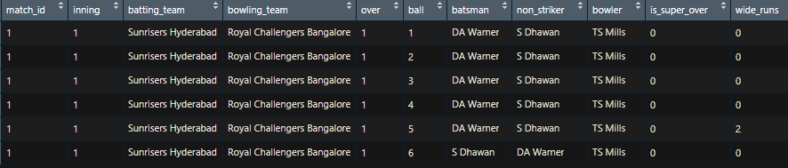
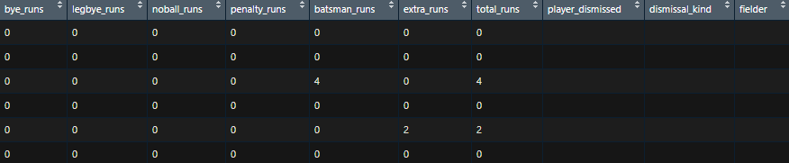

# Deliveries-Dataset

## INTRODUCTION
EDA of Deliveries Dataset. It contains information about each ball being bowled in 11 years of IPL. It comprises of 3,459,750 observations.
The dataset consist of the information about all the matches played between each teams in 11 editions of IPL(2008-2018). Various variables are present in the dataset includes match id, inning, batting team, bowling team, over, ball, batsman, non striker, bowler, is super over, wide runs, bye runs, legbye runs, noball runs, penalty runs, batsman runs, extra runs, total runs, player dismissed, dismissal kind, fielder.

## DATA
| Column Name | Description |
| --- | --- |
| `match_id` | match number |
| `inning` | innings can be 1st, 2nd |
| `batting team` | team name who is batting |
| `bowling team` | team name who is bowling |
| `over`| over number |
| `ball` | ball of the over |
| `batsman` | batsman name who played a ball |
| `non striker` | batsman name who is at non striker end |
| `bowler` | bowler name who is bowling |
| `is super over` | Is decision of match is taken by super over |
| `wide runs` | wide runs conceed by bowling team |
| `bye runs` | bye runs conceed by bowling team |
| `legbye runs` | legbye runs taken by batting team |
| `noball runs` | runs taken by batting team on noball |
| `penalty runs` | penalty runs conceed by team |
| `batsman runs` | runs scored by the batsman on that ball |
| `extra runs` | extra runs conceed on that ball |
| `total runs` | total runs scored on that ball |
| `player dismissed` | name of the player who gets out |
| `dismissal kind` | the way batsman gets out |
| `fielder` | fielder name who is fielding on that ball |

## PROJECT ANALYSIS
| Description | Analysis |
| --- | --- |
| ipl_data.head |  |
| ipl_data.head |  |

### Analysis Result
- Performance of each team in 11 IPLs (2008-18) and also found the best player for each team.
- 
